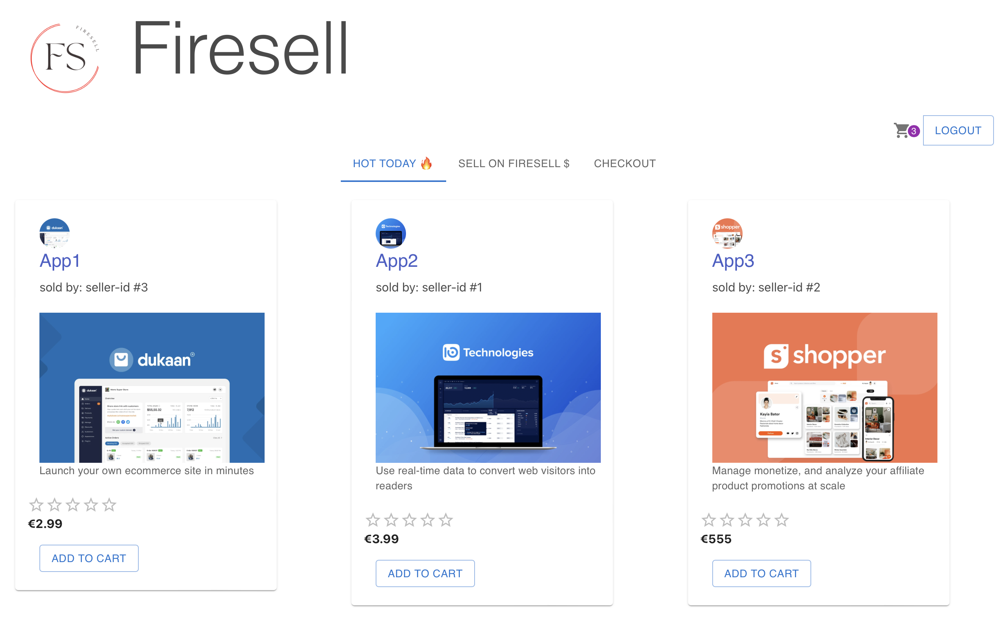
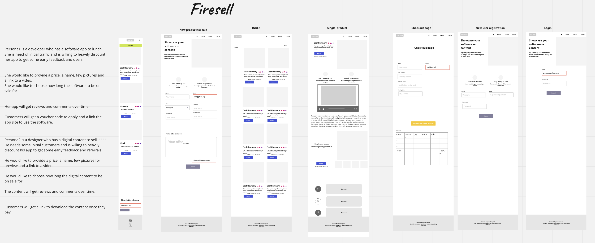
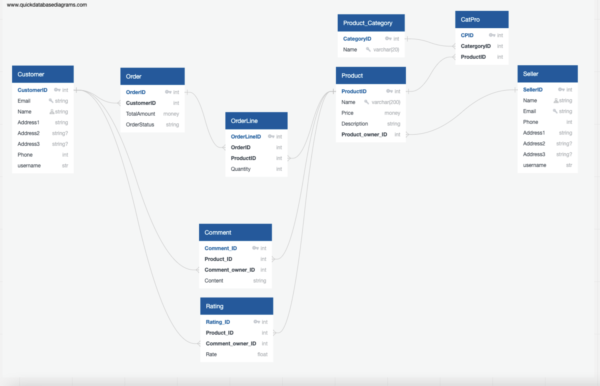
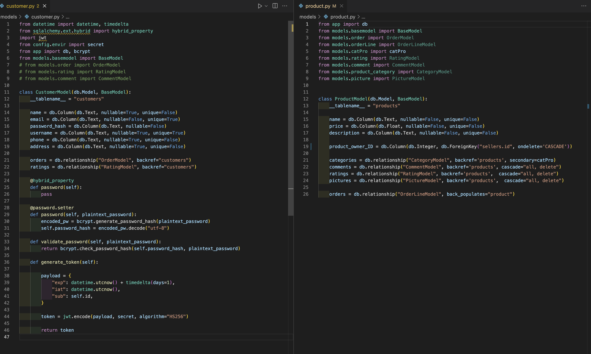
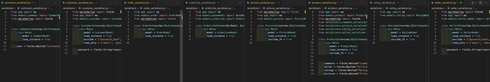

# Firesell app store

## Overview

This is the 4th project as part of the software engineering immersive course at General Assembly London.
The assignment was to create a full-stack website with React and Flask.
The project was to be completed **individually** within **5 days** over 2 weeks, for a total of 30 hours.

Preview: 

## Technologies used 

- Flask
- React
- Marshmallow
- Python
- SQLAlchemy
- HTML
- CSS
- Git and GitHub
- Bcrypt

## Approach

The idea was to make a site where developers and creators can sell software and content. Here are a few stories and wireframes I put together: 


I also did a database diagram:


Association tables for Product / Category and OrderLines took some time due to circular imports and the added Quantity field on the OrderLine. 

## Timeline
- Day 1: Data models
- Day 2: Join and association tables, serializers.
- Day 3: Controllers, Secure Route.
- Day 4: Controllers, frontend, UI library.
- Day 5: Cart updating, checkout, sellers registration and adding new products.


## Development

The largest data models were customer and product, see below:



Serializers with association tables can be fiddly to get right:




Once the above was done, getting the controllers and secure route was a breeze.

```

def secure_route(route_func):
    @wraps(route_func)
    def decorated_function(*args, **kwargs):
        raw_token = request.headers.get("Authorization")
        if not raw_token:
            return {
                "message": "Unauthorized, please check your credentials and try again"
            }, HTTPStatus.UNAUTHORIZED
        clean_token = raw_token.replace("Bearer ", "")
        try:
            payload = jwt.decode(clean_token, secret, "HS256")
            customer_id = payload["sub"]
            customer = CustomerModel.query.get(customer_id)
            if not customer:
                return {
                    "message": "Unauthorized, please check your credentials and try again"
                }, HTTPStatus.UNAUTHORIZED
            g.current_customer = customer
        except jwt.ExpiredSignatureError:
            return {"message": "Token has expired"}, HTTPStatus.UNAUTHORIZED
        except Exception as e:
            return {"message": "Unauthorized"}, HTTPStatus.UNAUTHORIZED
        return route_func(*args, **kwargs)
    return decorated_function
```

Controllers had to be done fast due to the limited amount of time as.


For the frontend I decided to go with an outside library - Material UI  https://mui.com/.
There was a learning curve, but it does save time building animations and elements.


Here is my Product component for example:

```
   <Card sx={{ maxWidth: 345, py: 1, pl: 2 }}>
      <Link to={`/product/${props.id}`}>
        <CardContent>
          <Avatar alt={props.name} src={props.pictures[0].url} />
          <Typography gutterBottom variant="h5" component="div">{props.name}</Typography>
          <div className="subtitle is-6">sold by: seller-id #{props.product_owner_ID}</div>
          <CardMedia
            component="img"
            height="140"
            image={props.pictures[0].url}
            alt={props.description}
          />
          <Typography variant="body2" color="text.secondary">{props.description}</Typography>
        </CardContent>
      </Link>
      <Stack spacing={2}>
        <Rating name="half-rating-read" defaultValue={props.rating} precision={0.5} readOnly />
        €{props.price}
      </Stack>
      <Button sx={{ mx: 1, m: 2 }} variant="outlined" onClick={() => handleAddtoCart()}>
        Add to cart</Button>
    </Card >
```

The last part was querying the backend for all the products the user is looking to buy. If I made it with just one item per purchase it would’ve been much simpler and faster to build and maybe considering a typical app store that made sense, but it wasn’t scalable. With a single product to buy - I could pass it as props on click for example. I could even store the whole product data in local storage, but felt unnecessary. 
If there was a category like 3D models - a user could visit the site and buy maybe 10-20-50 models at a time so that motivated the more scalable approach. 


```
 async function getProductData() {
    let itemsGet = JSON.parse(localStorage.getItem('cartItems'))
    if (itemsGet !== undefined) {
      let newSet = [...new Set(itemsGet)]
      let array = []
      for (let item in newSet) {
        array.push(new Promise(async (resolve) => {
          const { data } = await axios.get(`${baseUrl}/products/${newSet[item]}`)
          resolve(data)
        }))}
      setProductData(array)
      Promise.all(array).then((values) => {
        setProductData(values)
      })}}

  useEffect(() => {
    getProductData()
    const productInterval = setInterval(() => {
      getProductData()
    }, 10000);
    return () => { clearInterval(productInterval) }
  }, [])
```

This will update, so that if the user has 2 tabs open, e.g. one for shopping and one for their cart, the cart will update without having to refresh the page. Space needs can improved on the above of course. 

## Bugs, Wins & Learnings

Currently due to some configuration changes in the database hosting and postgresql updates - registration can be offline.

### Challenges 
Serializing was new at this point and there was a decent amount of it to be done. As for the circular import issue that arises from that - the objective was to get the order right so that a Schema is imported just once. 

On the frontend I had to learn about Promise and resolve, and Promise.all, to get the multiple products data needed as well some getting used to using ready made elements from Material UI with specific properties.

### Wins
Getting all the database tables right on the backend. On the frontend it was the checkout page where the user can delete items clear cart and checkout.

### Future improvements
The checkout needs to be completed on the backend, ratings code needs to be completed on the both the frontend and the backend.

As future improvements - adding ratings on the frontend, adding multiple categories of products, sorting, filter and pagination would be great. And a lot more can of course be added to make it a fully fledged store.

### Learnings
An assumption from the beginning was to to treat sellers and customers as different users, but that led to duplicate coding at a point of course, including the need to develop down the line a seperate secure route which is a waste. The thinking spawned from the fact that sellers would have different needs like getting money out the platform and providing download codes for their apps. But that could be one model extended different ways as the base is the same. 

## Credits
- Logo: Dimitar Vidolov (via canva.com).
--------
