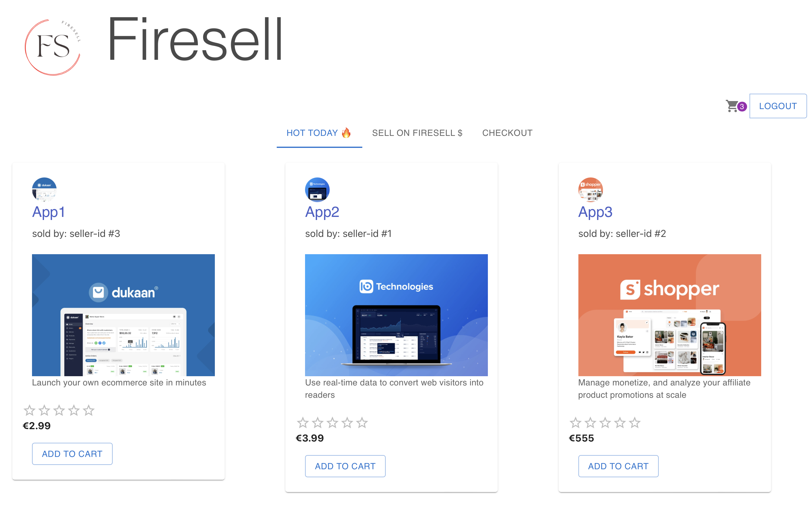

# firesell

## Overview

This is the 4th project as part of the software engineering immersive course at General Assembly London.
The assignment was to create a full-stack website with React and Flask.
The project was to be completed **individually** within **5 days** over 2 weeks, for a total of 30 hours.

Preview: 

## Technologies used 

- Flask
- React
- Marshmallow
- Python
- SQLAlchemy
- HTML
- CSS
- Git and GitHub
- Bcrypt

## Approach

The idea was to make a site where developers and creators can sell software and content. Here are a few stories and wireframes I put together: 

I also did a database diagram:

Association tables for Product / Category and OrderLines took some time due to circular imports and the added Quantity field on the OrderLine. 

## Timeline
- Day 1: Data models
- Day 2: Join and association tables, serializers.
- Day 3: Controllers, Secure Route.
- Day 4: Controllers, frontend, UI library.
- Day 5: Cart updating, checkout, sellers registration and adding new products.

--------

## Bugs, Wins & Learnings
Currently due to some configuration change in the database hosting sand postgresql updates - registration  can be buggy.

The big wins were getting all the database tables right on the backend.
On the frontend it was the checkout page where the user can delete items clear cart and checkout.

The checkout needs to be completed on the backend, ratings code needs to be completed on the both the frontend and the backend.

## Credits
- Logo: Dimitar Vidolov (via canva.com).
--------
